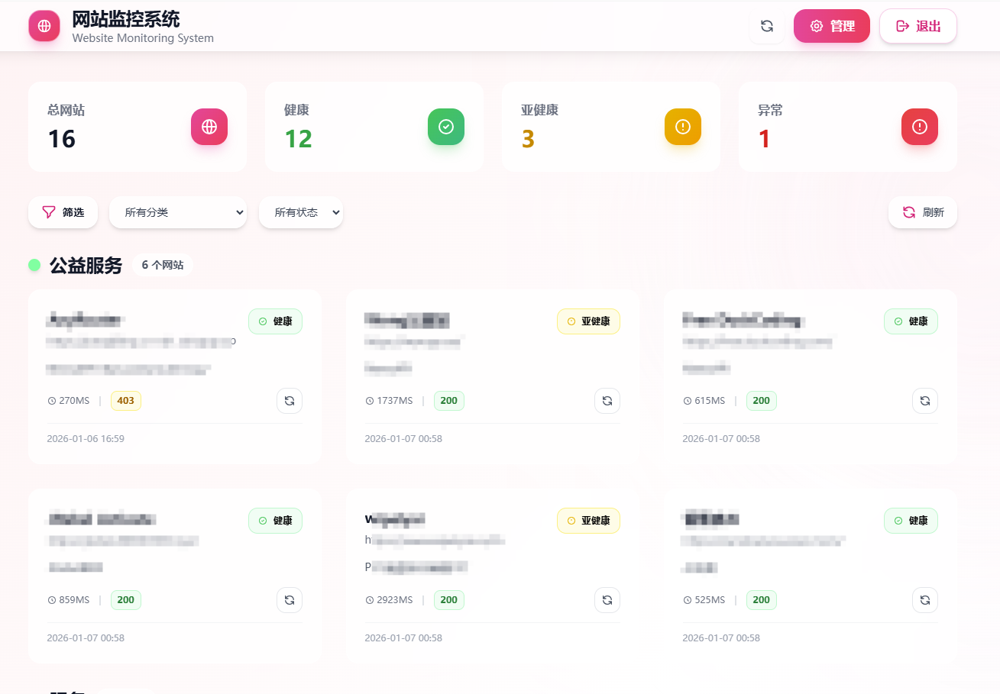
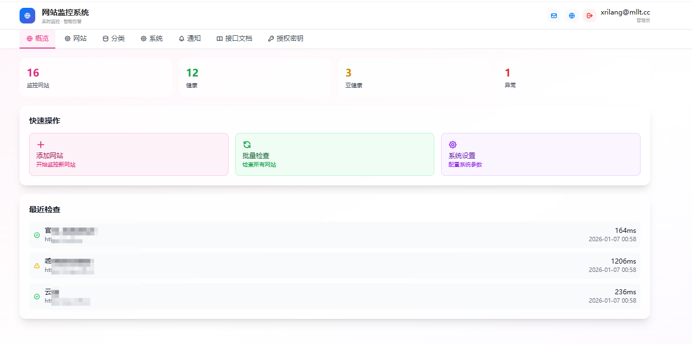
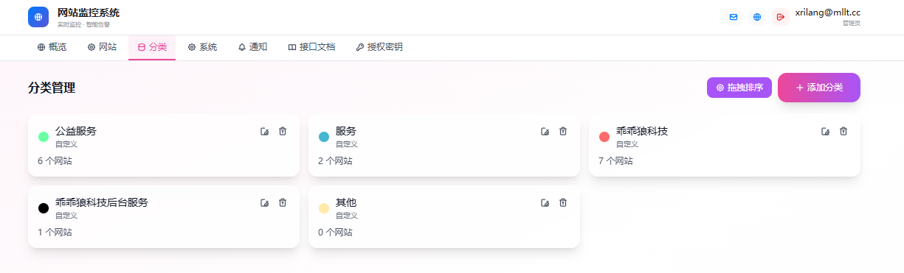
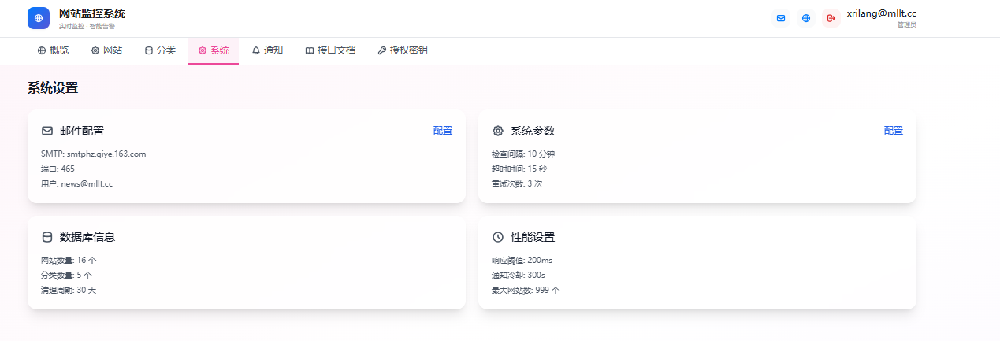

# 网站监控系统 (Website Monitor)

一个功能完善的网站健康状态监控与告警系统，基于 Next.js 15 构建，提供实时监控、邮件告警、分类管理等功能。

> 萌狼说：在使用前，建议全局搜索文本  批量替换_
> 然后你就知道要替换什么内容了
>
> 一定要这样做！！！
>
> 全局搜索
>
> 批量替换_
>
> 批量替换_
>
> 批量替换_
>
> 批量替换_

换成符合自己的内容











## 功能特性

### 核心功能

- **网站监控**：实时监控网站可用性和响应时间
- **智能检测**：采用 HEAD/GET 双重检查机制，避免误判
- **状态分类**：健康（≤1s）、警告（1-10s）、错误（>10s 或不可达）
- **批量操作**：支持批量添加、检查网站
- **监控日志**：完整记录每次检查结果

### 用户系统

- 用户名/密码登录
- 邮箱验证码登录
- 忘记密码/密码重置
- 角色权限管理（admin/user）

### 分类管理

- 自定义网站分类
- 分类颜色标记
- 拖拽排序功能

### 邮件通知

- SMTP 邮件配置
- 支持多种邮件服务商（Gmail、QQ、163、126、Outlook等）
- 网站异常告警通知
- 登录验证码邮件

## 技术栈

### 前端
- **框架**：Next.js 15.1.6 + React 19
- **语言**：TypeScript 5
- **样式**：Tailwind CSS 3.4
- **图表**：Recharts 2.8
- **拖拽**：@dnd-kit/core + @dnd-kit/sortable
- **图标**：Lucide React

### 后端
- **框架**：Next.js API Routes
- **数据库**：MySQL 5.7+
- **认证**：JWT (jsonwebtoken)
- **加密**：bcryptjs
- **邮件**：Nodemailer

## 环境要求

- Node.js 18+
- MySQL 5.7+
- npm 或 yarn

## 快速开始

### 1. 克隆项目

```bash
git clone <repository-url>
cd cm_websitemonitor
```

### 2. 安装依赖

```bash
cd website-monitor
npm install
```

### 3. 配置数据库

#### 3.1 创建数据库

```sql
CREATE DATABASE t_monitor CHARACTER SET utf8mb4 COLLATE utf8mb4_unicode_ci;
```

#### 3.2 导入数据表

使用项目根目录下的 SQL 文件初始化数据库：

```bash
mysql -u root -p t_monitor < t_monitor_20251206.sql
```

#### 3.3 修改数据库配置

编辑 `website-monitor/src/lib/db.ts` 文件，修改数据库连接信息：

```typescript
const pool = mysql.createPool({
  host: 'your-db-host',      // 数据库地址
  port: 3306,                 // 端口
  user: 'your-username',      // 用户名
  password: 'your-password',  // 密码
  database: 't_monitor',      // 数据库名
  connectionLimit: 10
});
```

### 4. 启动项目

#### 开发环境

```bash
cd website-monitor
npm run dev
```

访问 http://localhost:3000

#### 生产环境

```bash
cd website-monitor
npm run build
npm start
```

### 5. 默认账户

首次使用可使用以下默认管理员账户登录：

- **用户名**：xrilang
- **邮箱**：xrilang@mllt.cc
- **密码**：123456

> 请登录后立即修改默认密码！

## 部署指南

### 方式一：使用部署脚本

项目提供了便捷的部署脚本：

```bash
# 构建项目
bash .cozeproj/scripts/deploy_build.sh

# 运行项目（可通过 DEPLOY_RUN_PORT 环境变量指定端口）
export DEPLOY_RUN_PORT=3000
bash .cozeproj/scripts/deploy_run.sh
```

### 方式二：手动部署

#### 1. 构建生产版本

```bash
cd website-monitor
npm run build
```

#### 2. 使用 PM2 守护进程

```bash
# 安装 PM2
npm install -g pm2

# 启动服务
cd website-monitor
pm2 start npm --name "website-monitor" -- start

# 设置开机自启
pm2 startup
pm2 save
```

#### 3. Nginx 反向代理配置

```nginx
server {
    listen 80;
    server_name your-domain.com;

    location / {
        proxy_pass http://127.0.0.1:3000;
        proxy_http_version 1.1;
        proxy_set_header Upgrade $http_upgrade;
        proxy_set_header Connection 'upgrade';
        proxy_set_header Host $host;
        proxy_set_header X-Real-IP $remote_addr;
        proxy_set_header X-Forwarded-For $proxy_add_x_forwarded_for;
        proxy_set_header X-Forwarded-Proto $scheme;
        proxy_cache_bypass $http_upgrade;
    }
}
```

### 方式三：Docker 部署

创建 `Dockerfile`：

```dockerfile
FROM node:18-alpine

WORKDIR /app

COPY website-monitor/package*.json ./
RUN npm ci --only=production

COPY website-monitor/ .
RUN npm run build

EXPOSE 3000

CMD ["npm", "start"]
```

构建并运行：

```bash
docker build -t website-monitor .
docker run -d -p 3000:3000 --name website-monitor website-monitor
```

## 项目结构

```
cm_websitemonitor/
├── website-monitor/              # 主项目目录
│   ├── src/
│   │   ├── app/                  # Next.js App Router
│   │   │   ├── api/              # API 路由
│   │   │   │   ├── auth/         # 认证相关
│   │   │   │   ├── websites/     # 网站管理
│   │   │   │   ├── categories/   # 分类管理
│   │   │   │   ├── monitor/      # 监控功能
│   │   │   │   └── email/        # 邮件功能
│   │   │   ├── dashboard/        # 仪表盘页面
│   │   │   ├── login/            # 登录页面
│   │   │   └── settings/         # 设置页面
│   │   ├── components/           # React 组件
│   │   ├── lib/                  # 工具库
│   │   │   ├── db.ts             # 数据库连接
│   │   │   └── auth.ts           # 认证工具
│   │   └── types/                # TypeScript 类型定义
│   ├── public/                   # 静态资源
│   ├── package.json
│   └── tailwind.config.ts
├── .cozeproj/
│   └── scripts/                  # 部署脚本
├── t_monitor_20251206.sql        # 数据库初始化脚本
└── README.md
```

## API 接口

### 认证接口

| 方法 | 路径 | 描述 |
|------|------|------|
| POST | /api/auth/login | 用户名密码登录 |
| POST | /api/auth/login-with-code | 验证码登录 |
| POST | /api/auth/send-login-code | 发送登录验证码 |
| POST | /api/auth/forgot-password | 忘记密码 |
| POST | /api/auth/change-password | 修改密码 |
| GET | /api/auth/verify | 验证 Token |

### 网站管理

| 方法 | 路径 | 描述 |
|------|------|------|
| GET | /api/websites | 获取网站列表 |
| POST | /api/websites | 添加网站 |
| GET | /api/websites/[id] | 获取单个网站 |
| PUT | /api/websites/[id] | 更新网站 |
| DELETE | /api/websites/[id] | 删除网站 |
| POST | /api/websites/[id]/check | 检查单个网站 |

### 监控接口

| 方法 | 路径 | 描述 |
|------|------|------|
| POST | /api/monitor/check | 检查网站状态 |
| POST | /api/monitor/batch | 批量检查 |
| POST | /api/monitor/check-all | 检查所有网站 |

### 分类管理

| 方法 | 路径 | 描述 |
|------|------|------|
| GET | /api/categories | 获取分类列表 |
| POST | /api/categories | 添加分类 |
| PUT | /api/categories/[id] | 更新分类 |
| DELETE | /api/categories/[id] | 删除分类 |
| POST | /api/categories/reorder | 分类排序 |

### 邮件接口

| 方法 | 路径 | 描述 |
|------|------|------|
| GET | /api/email/config | 获取邮件配置 |
| POST | /api/email/config | 保存邮件配置 |
| POST | /api/email/test | 测试邮件发送 |

## 系统配置

默认系统配置（可在系统设置中修改）：

| 配置项 | 默认值 | 描述 |
|--------|--------|------|
| check_interval | 5 分钟 | 检查间隔 |
| request_timeout | 10 秒 | 请求超时时间 |
| max_retries | 3 次 | 失败重试次数 |
| notification_cooldown | 300 秒 | 通知冷却时间 |
| max_response_time | 200 毫秒 | 响应时间阈值 |
| log_retention_days | 30 天 | 日志保留天数 |
| max_websites_per_user | 50 个 | 每用户最大网站数 |

## 监控状态说明

| 状态 | 条件 | 说明 |
|------|------|------|
| healthy | 响应时间 ≤ 1000ms | 网站正常运行 |
| warning | 1000ms < 响应时间 ≤ 10000ms | 响应较慢，需关注 |
| error | 响应时间 > 10000ms 或请求失败 | 网站异常或不可达 |
| unknown | 尚未检测 | 等待首次检测 |

## 常见问题

### Q: 如何配置邮件通知？

1. 登录系统后进入"设置"页面
2. 点击"邮件配置"标签
3. 填写 SMTP 服务器信息
4. 点击"测试发送"验证配置
5. 保存配置

### Q: 监控检查失败怎么办？

1. 检查目标网站是否可正常访问
2. 确认网站未设置访问限制（如 IP 白名单）
3. 部分网站可能阻止 HEAD 请求，系统会自动降级为 GET 请求

### Q: 如何修改监控检查间隔？

在"系统设置"中修改 `check_interval` 配置项。

## License

MIT License
